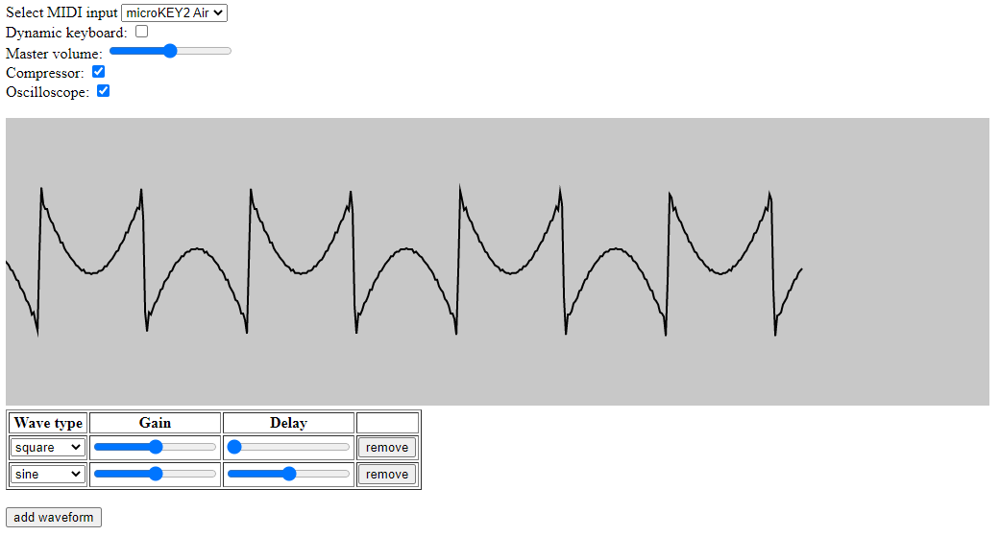

# Brawser-based sound synthesizer using Web MIDI API

Simple web app created in TypeScript that enables connecting MIDI devices and sound wave synthesis with frequency based on the inputs.

Main features:
- MIDI device connection and input handling
- creating desired sound waves by adding primitives (square, sawtooth, triangle, sine) with adjustable amplitudes and shifts
- synthesizing created waves to speaker output
- oscilloscope visualization

Project made for Engineering thesis in Computer Science on Wroclaw University of Science and Technology.
